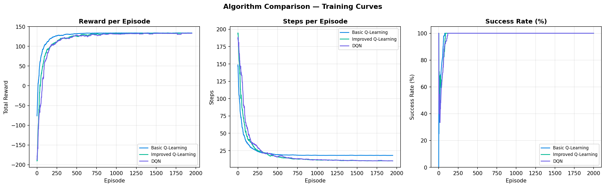
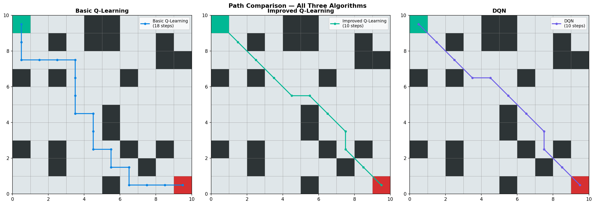
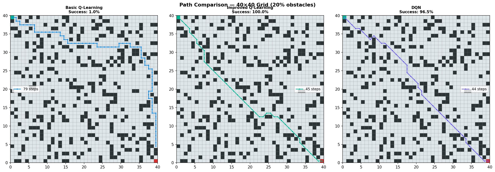
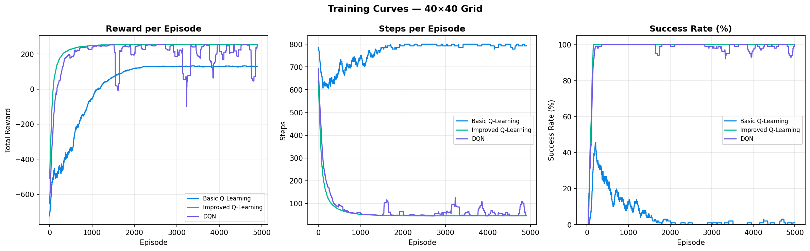

# Q-Learning Based Collision-Free Path Planning for Mobile Robots in Unknown Environments

**Tanish Anand** · Roll No. 240150037 · DA221 · IIT Guwahati

Implementation and comparison of **Basic Q-Learning**, **Improved Q-Learning** (8 actions, distance-based rewards, APF gravity), and **Deep Q-Network (DQN)** for grid-based robot navigation without a prior map — extending ideas from [Wang et al., ICIEA 2022](https://doi.org/10.1109/ICIEA54703.2022.10006304).

## About

Path planning in **unknown** environments is hard because the robot cannot rely on a full map (unlike A* or Dijkstra). This project uses **reinforcement learning**: the agent learns collision-free paths through trial and error via a reward signal.

| Approach | Idea |
|----------|------|
| **Basic Q-Learning** | Tabular Q-table, 4 actions, ε-greedy exploration |
| **Improved Q-Learning** | 8 directions, dynamic distance reward, APF gravity toward goal |
| **DQN** | Neural Q-function for generalization to unseen states |

**Environment:** 10×10 grid (default), 20% random obstacles, start `(0,0)` → goal `(9,9)`. Large-scale tests use **40×40** grids.

## Results

### 10×10 grid (averaged over 10 random environments)

| Metric | Basic QL | Improved QL | DQN |
|--------|----------|-------------|-----|
| Success rate (%) | 80.0 ± 40.0 | **100.0 ± 0.0** | **100.0 ± 0.0** |
| Path length (steps) | 16.2 ± 4.8 | **10.2 ± 0.6** | **10.2 ± 0.6** |
| Direction changes | 7.5 ± 3.1 | **3.2 ± 1.4** | 3.5 ± 1.7 |
| Convergence (episodes) | 468.1 ± 768.7 | **76.8 ± 8.4** | 80.3 ± 10.6 |
| Training time (s) | 1.9 ± 2.5 | **0.7 ± 0.1** | 219.7 ± 11.2 |

Improved Q-learning cuts average path length by **~44%** vs basic Q-learning while reaching **100%** success with low variance. DQN matches path quality on small grids but is far slower to train; it scales better when the state space grows.

### 40×40 grid (scalability)

| Algorithm | Success rate | Typical path length |
|-----------|--------------|---------------------|
| Basic QL | ~1% | Fails to generalize |
| Improved QL | **100%** | ~45 steps |
| DQN | **96.5%** | ~44 steps |

On large grids the tabular Q-table breaks down; improved Q-learning and DQN still navigate effectively.

### Figures

**Training curves (10×10)** — `python run.py compare --preset small`



**Learned paths (10×10)**



**Large grid (40×40)** — `python run.py large --preset large`





## Methodology (summary)

- **Basic Q-Learning:** \(Q(s,a) \leftarrow Q(s,a) + \alpha [r + \gamma \max_{a'} Q(s',a') - Q(s,a)]\), ε-greedy with decay.
- **Improved Q-Learning:** 8-action space; reward combines goal/obstacle terms, distance change \(k \cdot (d(s,g) - d(s',g))\), and APF gravity \(F = \zeta / \rho(s,g)\).
- **DQN:** MLP `Input(2) → 64 → ReLU → 64 → ReLU → 8`, target network, replay buffer (10k), Adam optimizer.

Key parameters: \(\gamma = 0.9\), \(\epsilon_{\min} = 0.01\), \(R_{\text{goal}} = 100\), \(R_{\text{obs}} = -5\), \(k = 2.0\), \(\zeta = 0.5\), 2000 training episodes (10×10).

## Features
- Tabular Q-learning (4 and 8 action spaces)
- DQN with PyTorch (CPU or CUDA)
- Side-by-side algorithm comparison and path visualization
- Small (10×10) and large (40×40) grid presets
- Multi-seed evaluation across many random environment layouts
- All training plots saved under `results/`

## Project structure

```
Mobile_robot/
├── run.py                      # CLI entry point (use this to run experiments)
├── requirements.txt
├── README.md
├── results/                    # Generated PNG plots
└── src/
    ├── algorithms/
    │   ├── q_learning_robot.py      # Basic Q-Learning
    │   ├── improved_q_learning.py   # Improved Q-Learning + APF
    │   └── dqn_robot.py             # DQN
    └── experiments/
        ├── comparison.py            # Compare all three on one grid
        ├── large_grid_experiment.py # Large-grid comparison
        └── multiple.py              # Average metrics over many seeds
```

Your original training logic lives unchanged under `src/`; `run.py` only sets hyperparameters and redirects `matplotlib` output to `results/`.

## Setup

```bash
cd AI_Project
python -m venv .venv

# Windows
.venv\Scripts\activate

# macOS / Linux
source .venv/bin/activate

pip install -r requirements.txt
```

## How to run

Always run from the project root:

```bash
python run.py <command> [options]
```

### Commands

| Command | Description |
|---------|-------------|
| `basic` | Train basic Q-Learning (4 actions) |
| `improved` | Train improved Q-Learning (8 actions) |
| `dqn` | Train DQN |
| `compare` | Run all three algorithms on the same grid and plot comparison |
| `large` | Full comparison on a large grid (default 40×40) |
| `multi` | Run `compare` across multiple random seeds and print averaged metrics |

### Grid presets

| Preset | Grid | Episodes | Max steps / episode |
|--------|------|----------|---------------------|
| `small` | 10×10 | 2000 | 300 |
| `large` | 40×40 | 5000 | 800 |

```bash
# Small grid — single algorithms
python run.py basic --preset small
python run.py improved --preset small
python run.py dqn --preset small

# Compare all three (small grid)
python run.py compare --preset small

# Large grid experiment
python run.py large --preset large

# Custom grid size and training length
python run.py compare --grid-size 20 --episodes 3000 --max-steps 500

# Multiple environments (10 random layouts by default)
python run.py multi --num-envs 10 --preset small

# 5 environments on a 25×25 grid, custom seed start
python run.py multi --num-envs 5 --grid-size 25 --seed 100
```

### Other options

| Flag | Purpose |
|------|---------|
| `--grid-size N` | Override grid width/height |
| `--episodes N` | Training episodes |
| `--max-steps N` | Step limit per episode |
| `--seed N` | Random seed (single-run commands) or starting seed for `multi` |
| `--obstacle-ratio R` | Obstacle density (e.g. `0.2` = 20%) |
| `--num-envs K` | Number of environments for `multi` (seeds `K`, `K+1`, …) |

### Output files

Plots are written to `results/`:

| Script | Files |
|--------|--------|
| `basic` | `basic_path.png`, `basic_curves.png` |
| `improved` | `improved_path.png`, `improved_curves.png` |
| `dqn` | `dqn_path.png`, `dqn_curves.png` |
| `compare` | `comparison_paths.png`, `comparison_curves.png` |
| `large` | `large_grid_paths.png`, `large_grid_curves.png` |

`multi` prints a summary table only (no extra plots).

## Tech stack

- Python 3.10+
- NumPy, Matplotlib
- PyTorch (DQN and large-grid experiments)

## Reference

Y. Wang, S. Wang, Y. Xie, and Y. Hu, “Q-Learning based Collision-free Path Planning for Mobile Robot in Unknown Environment,” *IEEE ICIEA*, 2022. [doi:10.1109/ICIEA54703.2022.10006304](https://doi.org/10.1109/ICIEA54703.2022.10006304)

